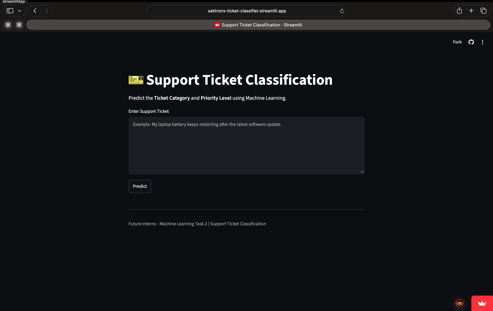
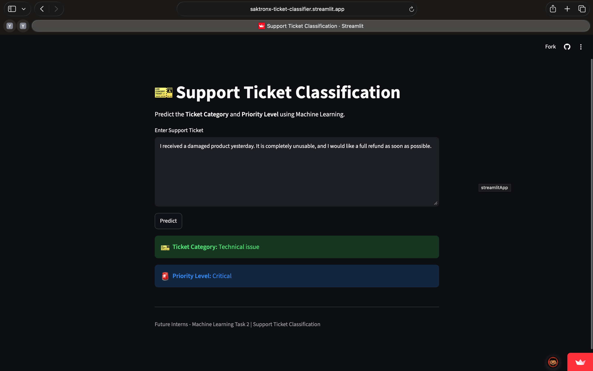
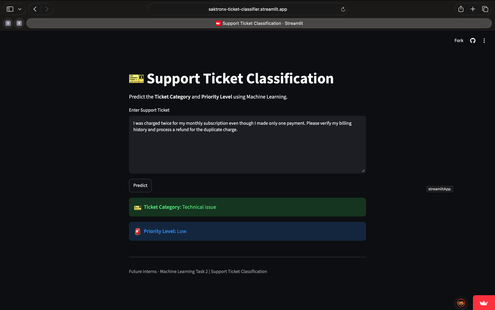
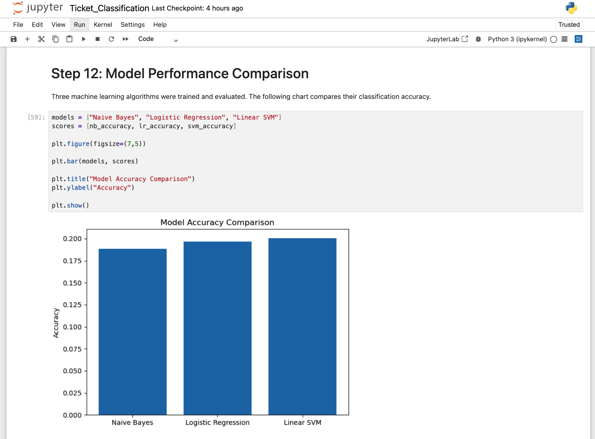
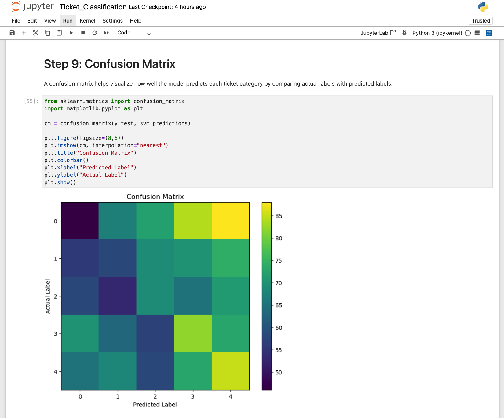
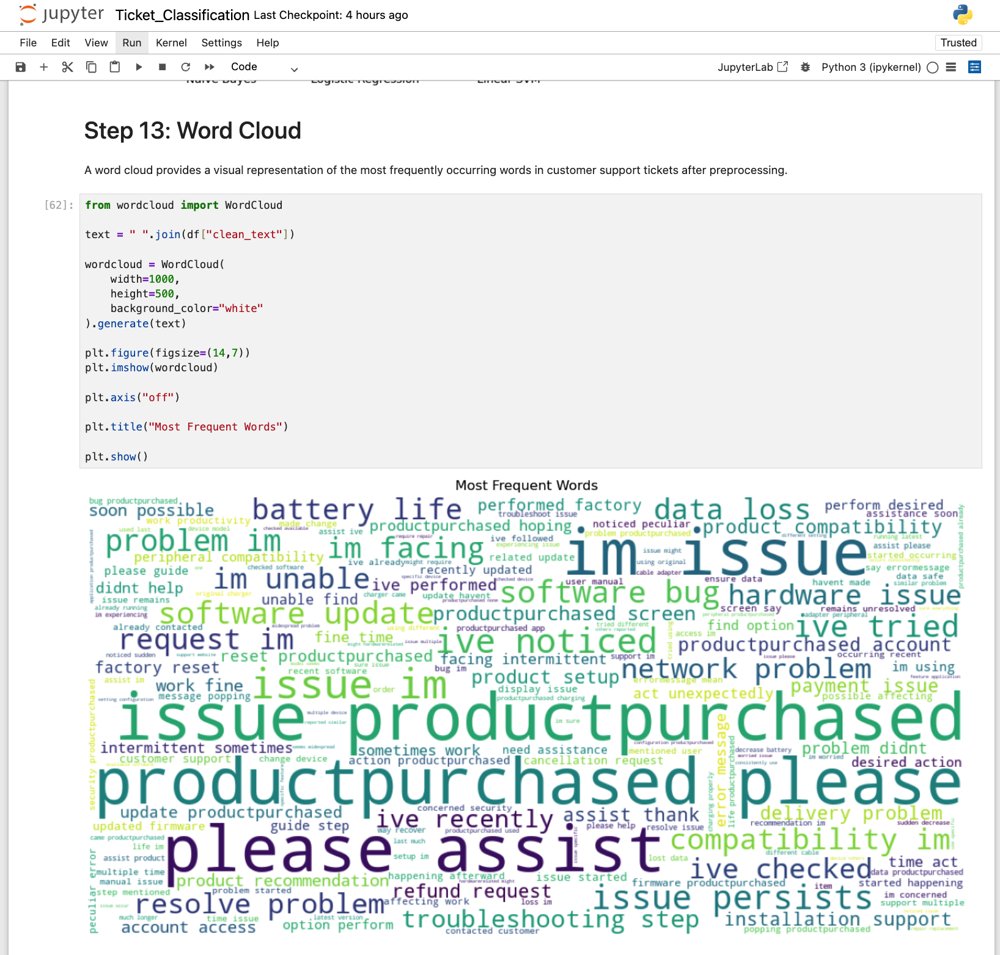

# 🎫 Support Ticket Classification using Machine Learning

A Machine Learning project that automatically classifies customer support tickets into different categories and predicts their priority level using Natural Language Processing (NLP).

This project was developed as part of **Future Interns – Machine Learning Task 2**.

---

## 🚀 Live Demo

🌐 **Streamlit App**

https://saktronx-ticket-classifier.streamlit.app/

---

## 📌 Project Overview

Customer support teams receive thousands of tickets every day. Manually identifying the ticket category and priority is time-consuming and inefficient.

This project automates that process using Machine Learning by predicting:

- 🎫 Ticket Category
- 🚨 Ticket Priority

The application is deployed using Streamlit and allows users to enter any support ticket to receive instant predictions.

---

## 🎯 Features

- Automatic Ticket Classification
- Ticket Priority Prediction
- Text Preprocessing using NLP
- TF-IDF Feature Extraction
- Multiple ML Model Comparison
- Interactive Streamlit Web App
- Confusion Matrix Visualization
- Word Cloud Visualization
- Deployed Online

---

## 🧠 Machine Learning Workflow

1. Data Collection
2. Data Cleaning
3. Text Preprocessing
   - Lowercasing
   - Removing punctuation
   - Removing stopwords
   - Lemmatization
4. Feature Extraction using TF-IDF
5. Train-Test Split
6. Model Training
7. Model Evaluation
8. Model Comparison
9. Model Saving using Joblib
10. Streamlit Deployment

---

## 🤖 Machine Learning Models Used

- Naive Bayes
- Logistic Regression
- Linear Support Vector Machine (Linear SVM)

Among all models, **Linear SVM** achieved the best performance and was selected for deployment.

---

## 🛠️ Tech Stack

- Python
- Scikit-learn
- Pandas
- NumPy
- NLTK
- Matplotlib
- WordCloud
- Joblib
- Streamlit

---

# 📸 Project Screenshots

## 🏠 Home Page

The landing page of the Streamlit application.



---

## 🎫 Prediction Example 1

Predicting ticket category and priority for a technical support issue.



---

## 🎫 Prediction Example 2

Prediction for another customer support ticket.



---

## 📊 Model Comparison

Comparison of classification accuracy across different machine learning models.



---

## 📈 Confusion Matrix

Evaluation of the final Linear SVM model.



---

## ☁️ Word Cloud

Most frequently occurring words after preprocessing.



---

# 📂 Project Structure

```
Support-Ticket-Classification/
│
├── Dataset/
│
├── models/
│   ├── classifier.pkl
│   └── vectorizer.pkl
│
├── notebook/
│
├── screenshots/
│   ├── home.png
│   ├── prediction1.png
│   ├── prediction2.png
│   ├── model_comparison.png
│   ├── confusion_matrix.png
│   └── wordcloud.png
│
├── app.py
├── requirements.txt
└── README.md
```

---

# ⚙️ Installation

Clone the repository

```bash
git clone https://github.com/saktronX/FUTURE_ML_02.git
```

Move into the project folder

```bash
cd FUTURE_ML_02
```

Install dependencies

```bash
pip install -r requirements.txt
```

Run the Streamlit application

```bash
streamlit run app.py
```

---

# 📊 Dataset

The dataset contains customer support tickets with the following information:

- Ticket Text
- Ticket Category
- Ticket Priority

Example categories include:

- Technical Issue
- Billing Inquiry
- Product Inquiry
- Cancellation Request
- Refund Request

Priority levels include:

- Low
- Medium
- High
- Critical

---

# 📈 Results

- Successfully trained multiple ML models.
- Compared model performance.
- Selected Linear SVM for deployment.
- Built a fully functional Streamlit application.
- Predicted both ticket category and priority.
- Successfully deployed online.

---

# 🔮 Future Improvements

- Deep Learning models (LSTM/BERT)
- Confidence score for predictions
- Multi-language ticket classification
- Automatic ticket routing
- Email integration
- Cloud database support

---

# 👨‍💻 Author

**Saksham Verma**

GitHub: https://github.com/saktronX

---

# 📜 License

This project is developed for educational purposes as part of the **Future Interns Machine Learning Internship Program**.